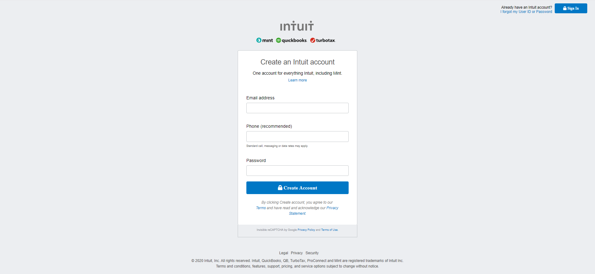

# SignUp form

> This project is a responsive SignUp page.

Responsive static sign up form which can be integrated to any backend.

## Built With

- HTML
- CSS
- Flexbox

## Live Demo

[Live Demo Link](https://rawcdn.githack.com/bmuhamood/mint-project/25814e918c37b4810c70bf5703a5a13fdde441b1/index.html)

## Authors

👤 **Jonathas Tavares**

- Github: [@jonathastavares](https://github.com/jonathastavares)
- Twitter: [@jhstavares](https://twitter.com/jhstavares)
- Linkedin: [linkedin](https://www.linkedin.com/in/jonathas-tavares-24b8bba3/)

👤 **Bbosa Muhamood**

- Github: [@bmuhamood](https://github.com/bmuhamood)
- Twitter: [@croixtechfirm](https://twitter.com/croixtechfirm)
- Linkedin: [linkedin](https://www.linkedin.com/in/bbosa-muhamood-06845576/)

## 🤝 Contributing

Contributions, issues and feature requests are welcome!

Feel free to check the [issues page](https://github.com/bmuhamood/mint-project/issues).

## Show your support

Give a ⭐️ if you like this project!

## 📝 License

This project is [MIT](lic.url) licensed.
